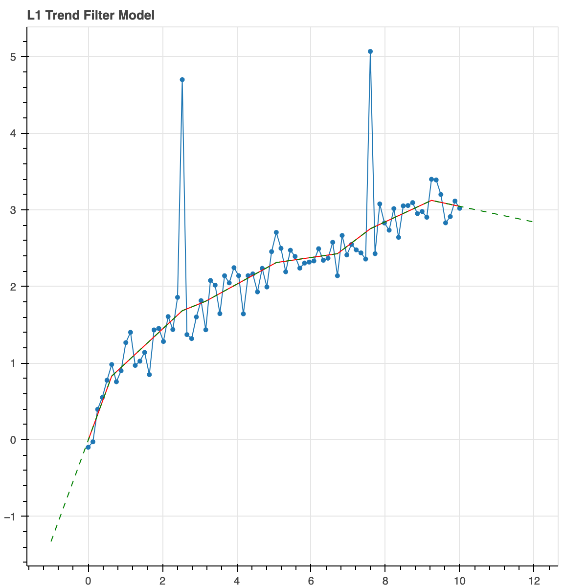
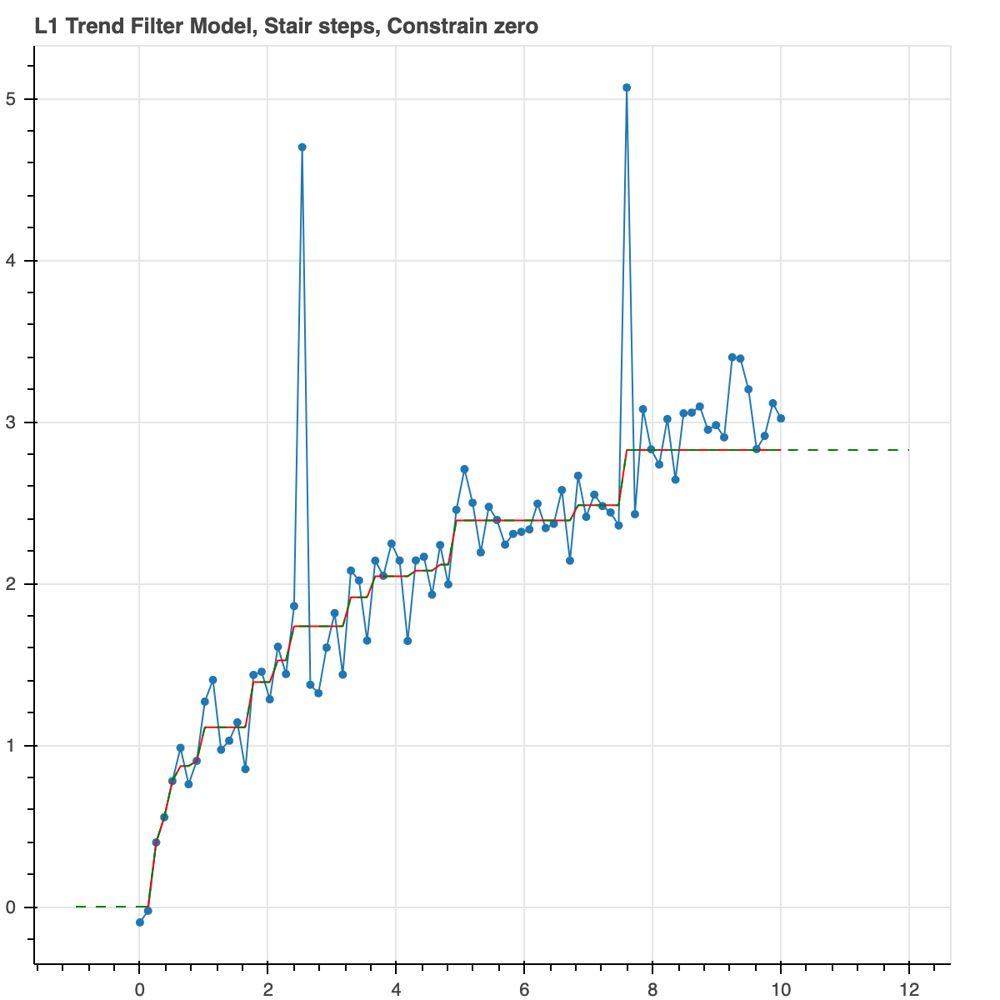

# trendfilter: 

Trend filtering is about building a model for a 1D function
(could be a time series) that has some nice properties such as 
smoothness or sparse changes in slopes (piecewise linear).

The objective to be minimized is, in our case, Huber loss with
regularization on 1st and 2nd derivative plus some constraints. 
Can be either L1 or L2 norms for regularization.

This library provides a flexible and powerful 
python function to do this and is built on top of the 
cvxpy optimization library.

# Install

pip install trendfilter

or clone the repo. 

# Examples:

Contruct some x, y data where there is noise as well as few 
outliers. See 
[test file](https://github.com/dave31415/trendfilter/blob/master/test/test_tf.py)
for prep_data code and plotting code.

First build the base model with no regularization. This is essentially
just an overly complex way of constructing an interpolation function. 

```
x, y_noisy = prep_data()
result = trend_filter(x, y_noisy)
```


This has no real use by itself. It's just saying the model is the
same as the data points.

You'll always want to give it some key-words to
apply some kind of regularization or constraint so that the model
is not simply the same as the noisy data.

Let's do something more useful. Don't do any regularization yet. Just
force the model to be monotonically increasing. So basically, it 
is looking for the model which has minimal Huber loss but is 
constrained to be monotonically increasing. 

We use Huber loss because it is robust to outliers while still
looking like quadratic loss for small values.

```
result = trend_filter(x, y_noisy, monotonic=True)
```


The green line, by the way, just shows that the function can be extrapolated 
which is a very useful thing, for example, if you want to make predictions
about the future.

Ok, now let's do an L1 trend filter model. So we are going to 
penalize any non-zero second derivative with an L1 norm. As we 
probably know, L1 norms induce sparseness. So the second dervative at 
most of the points will be exactly zero but will probably be non-zero
at a few of them. Thus, we expect piecewise linear trends that 
occasionally have sudden slope changes.

```
result = trend_filter(x, y_noisy, l_norm=1, alpha_2=0.2)
```



Let's do the same thing but enforce it to be monotonic.

```
result = trend_filter(x, y_noisy, l_norm=1, alpha_2=0.2, monotonic=True)
```


Now let's increase the regularization parameter to give a higher
penalty to slope changes. It results in longer trends. Fewer slope
changes. Overall, less complexity.

```
result = trend_filter(x, y_noisy, l_norm=1, alpha_2=2.0)
```


Did you like the stair steps? Let's do that again. But now
we will not force it to be monotonic. We are going to put an
L1 norm on the first derivative. This produces a similar 
output but it could actually decrease if the data actually
did so. Let's also constrain the curve to go through the origin, 
(0,0).

```
result = trend_filter(x, y_noisy, l_norm=1, alpha_1=1.0, constrain_zero=True)
```




Let's do L2 norms for regularization on the second 
derivative. L2 norms don't care very much about small values. 
They don't force them all the way to zero to create sparse 
solution. They care more about big values. This results is a 
smooth continuous curve. This is a nice way of doing robust 
smoothing. 

```
result = trend_filter(x, y_noisy, l_norm=2, alpha_2=2.0)
```


Here is the full function signature.

```
def trend_filter(x, y, y_err=None, alpha_1=0.0,
                 alpha_2=0.0, l_norm=2,
                 constrain_zero=False, monotonic=False,
                 positive=False,
                 linear_deviations=None):
```

So you see there are alpha key-words for regularization parameters. 
The number n, tells you the derivative is being penalized.
You can use any, all or none of them. The key-word
l_norm gives you the choice of 1 or 2. Monotonic and 
constrain_zero, we've explained already. positive forces the 
base model to be positive. linear_deviations will be explained in a bit.

The data structure returned by trend_filter is a dictionary with various
pieces of information about the model. The most import are 
'y_fit' which is an array of best fit model values corresponding to 
each point x. The 'function' element is a function mapping any x to the
model value, including points outside the initial range. These external 
points will be extrapolated linearly. In the case that the data is a 
time-series, this function can provide forecasts for the future.

We didn't discuss y_err. That's the uncertainty on y. The
default is 1. The Huber loss is actually applied to (data-model)/y_err.
So, you can weight points differently if you have a good reason to,
such as knowing the actual error values or knowing that some points 
are dubious or if some points are known exactly. That would be the limit
as y_err goes towards zero and it will make the curve go through those
points.

All in all, these keywords give you a huge amount of freedom in
what you want your model to look like.

Enjoy!


